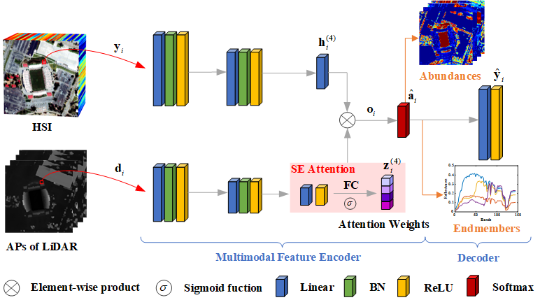
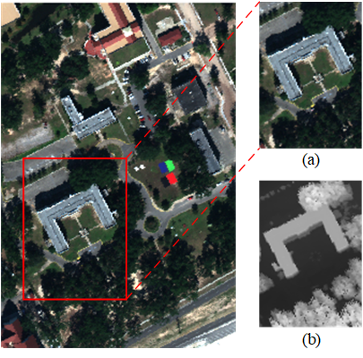
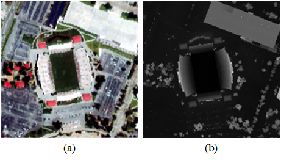

# Multimodal Hyperspectral Unmixing: Insights from Attention Networks

[Zhu Han](https://www.researchgate.net/profile/Zhu-Han-2), [Danfeng Hong](https://sites.google.com/view/danfeng-hong), [Lianru Gao](https://scholar.google.com/citations?hl=en&user=f6OnhtcAAAAJ), [Jing Yao](https://scholar.google.com/citations?user=1SHd5ygAAAAJ&hl=en), [Bing Zhang](http://english.radi.cas.cn/Education/PhDS/201401/t20140109_115415.html), [Jocelyn Chanussot](http://jocelyn-chanussot.net/)

___________

The code in this toolbox implements the ["Multimodal Hyperspectral Unmixing: Insights from Attention Networks"](https://ieeexplore.ieee.org/document/9724217) in IEEE Transactions on Geoscience and Remote Sensing (TGRS). More specifically, it is detailed as follow.




    
Usage
---------------------
### Dataset
* **Muffle** was collected over the campus of Southern Mississippi-Gulfpark. The original image has 325 × 220 pixels and 64 bands in the spectral range from 0.375 to 1.050 μm. We select a popular region of interest (ROI) with a size of 130 × 90 pixels, and five dominated materials in this scene are investigated: #1 Roof, #2 Grass, #3 Tree, #4 Shadow and #5 Asphalt.

<p align="center">

    
* **Houston** was acquired by the ITRES CASI-1500 sensor over the University of Houston campus, TX, USA, in June 2012. This data set was originally released by the 2013 IEEE GRSS data fusion contest2, and it has been widely applied for evaluating the performance of land cover classification. The original image is 349 × 1905 pixels recorded in 144 bands ranging from 0.364 to 1.046 μm. We investigate a 170 × 170 pixel subimage cropped from the original image, and four endmembers in this scene are #1 Parking lot1, #2 Parking lot2, #3 Running track and #4 Grass healthy.

<p align="center">


### Generate Attribute Profile
The attribute profiles for LiDAR is applied based on the research work of [Dr. Liao](https://telin.ugent.be/~wliao/Partial_Reconstruction/). How to use the code can refer to this

```bash
num_scales = 2;

MPNeach=getmorphprofiles(ldr_image,'euclidean','square',num_scales);    

MPN=cat(3,MPNeach,ldr_image);
```

### Training
    
* `./main.py` is the script for training the multimodal unmixing network on two real multimodal datasets. Note that, different seed settings will affect the convergence of the loss function. You need to choose the suitable seed to ensure the convergence of the loss function according to the adopted computer equipment.

```bash
python main.py --fix_random --seed=10 --epoch=50 --dataset='muffle' --batch_size=128 --learning_rate_en=3e-4 --learning_rate_de=1e-4 --lamda=3e-2 --delta=1 --weight_decay=1e-5
```
    
```bash
python main.py --fix_random --seed=5 --epoch=40 --dataset='houston170' --batch_size=256 --learning_rate_en=1e-4 --learning_rate_de=5e-4  --lamda=8e-2 --delta=0.5 --weight_decay=1e-5
```

* If you want to run the code in your own data, you can accordingly change the input and tune the parameters, such as lamda, delta, and learning rate.
    
### Testing
    
After training the MUNet on the two created datasets, the extracted abundance and endmember results are saved as a MAT file. You can utilize `./result_display.m` to evaluate the unmixing performance.
    
Citation
---------------------

**Please kindly cite the papers if this code is useful and helpful for your research.**

Zhu Han, Danfeng Hong, Lianru Gao, Jing Yao, Bing Zhang, Jocelyn Chanussot. Multimodal Hyperspectral Unmixing: Insights from Attention Networks, IEEE Transactions on Geoscience and Remote Sensing, vol. 60, pp. 1-13, 2022, Art no. 5524913, doi: 10.1109/TGRS.2022.3155794.

    @article{han2022munet,
      title={Multimodal hyperspectral unmixing: insights from attention networks},
      author={Han, Zhu and Hong, Danfeng and Gao, Lianru and Yao, Jing and Zhang, Bing and Chanussot, Jocelyn},
      journal={IEEE Trans. Geosci. Remote Sens.},
      note = {DOI: 10.1109/TGRS.2022.3155794},
      volume={60}, 
      pages={1-13},
      year={2022}  
    }
    
Contact Information
---------------------
Zhu Han: hanzhu19@mails.ucas.ac.cn
